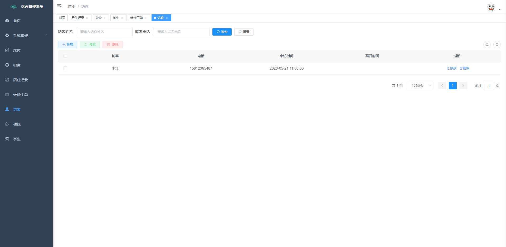

## 宿舍后台管理系统

jdk8、mysql8

体验地址：www.cdmzl.cn:8081

## 近期改进

### 2024年3月31日

1. 修复系统相关bug

### 2024年3月28日

1. 首页统计功能完善、访问数据统计分析；
2. 床位入住bug解决，学生信息支持批量导入；

## 包含功能

* 住宿信息管理：记录学生的住宿信息，如房间号码、床位号码等。
* 报修管理：记录宿舍设备设施维修记录。
* 用户权限管理：为不同的用户分配不同的权限，确保数据的安全性和可用性。
* 访客管理：记录来源人员信息，包含姓名、联系电话、来访时间、离开时间。

## 运行步骤

新建一个数据库,然后执行，script/sql/dormitory-202305212130.sql

然后先改application-dev.yml中数据库连接为本地数据库地址

## 系统截图

## 支持作者

如果觉得这套源码对你有所帮助可以赞助一下作者，万分感谢。赞助加Q(1946462076)或V(cdmzlsoft)及时答疑指导。

**加好友时:备注订单号**

## 感谢

[RuoYi-Vue](https://gitee.com/y_project/RuoYi-Vue)

